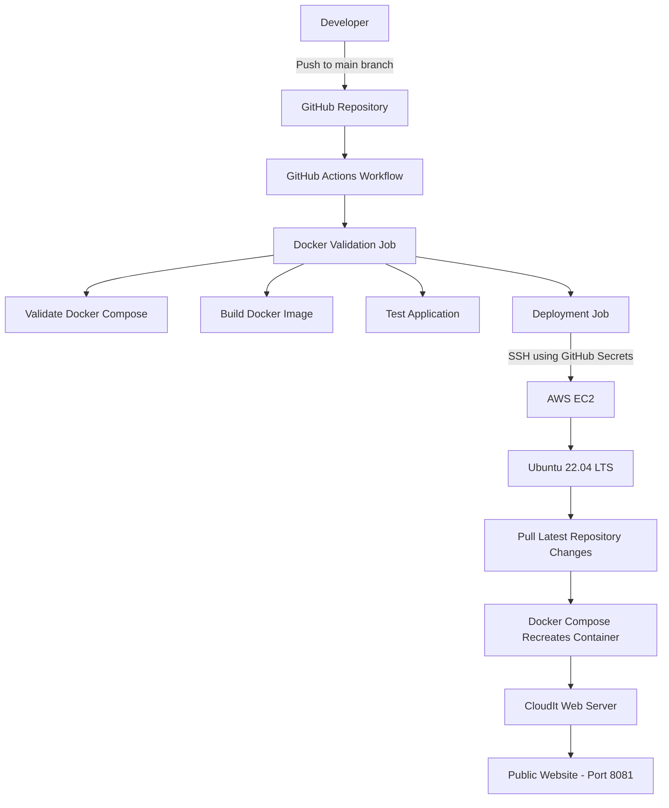
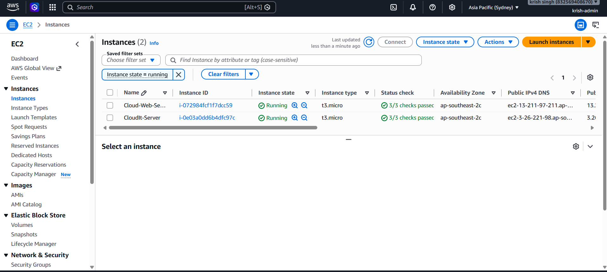
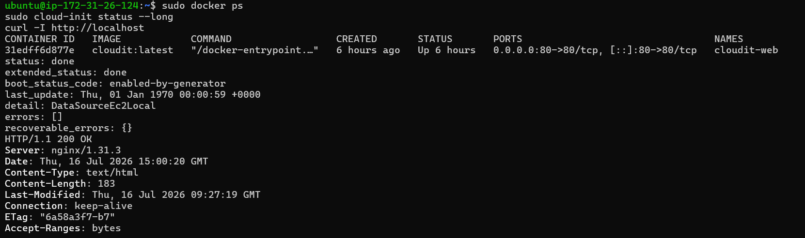
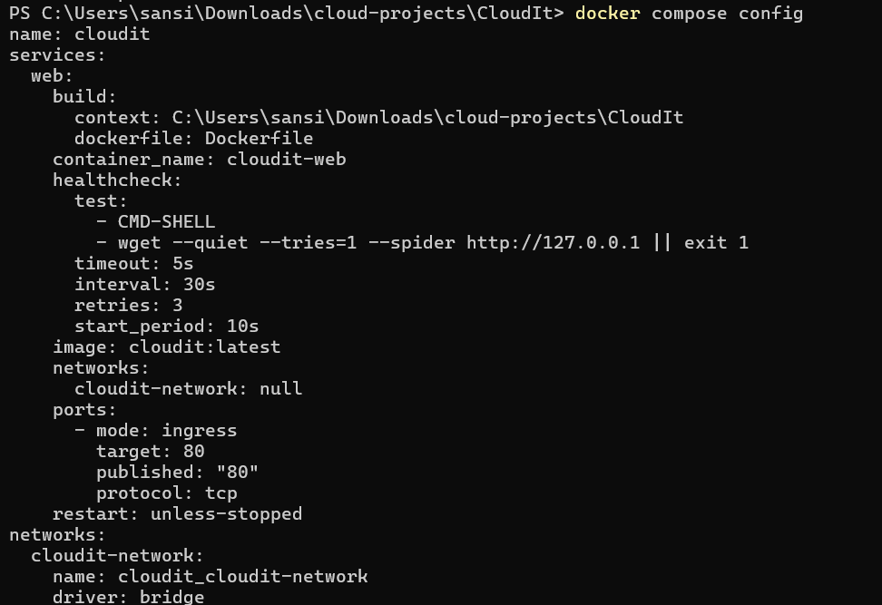
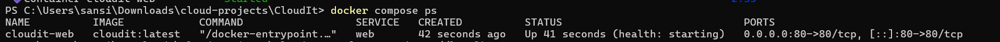
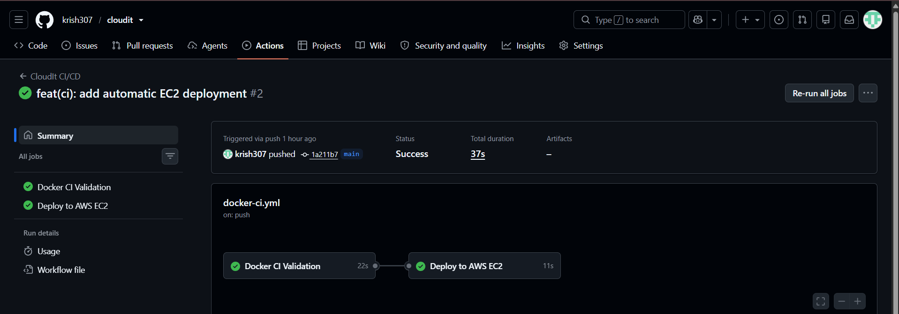
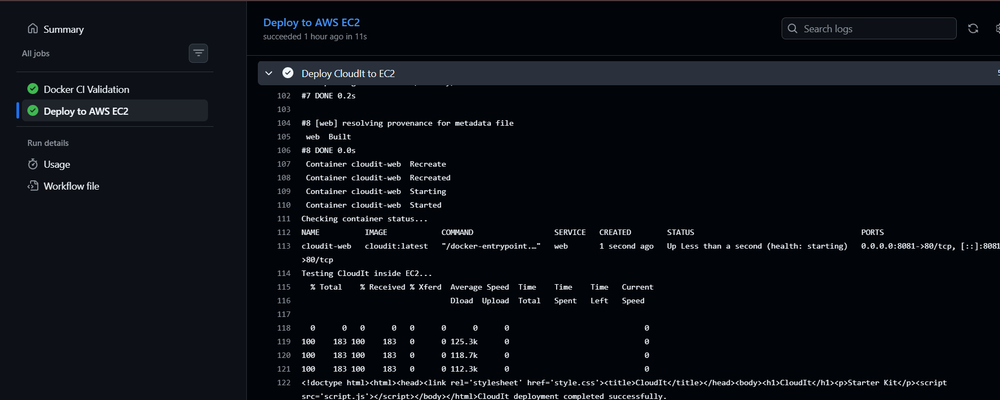

# ☁️ CloudIt


<p align="center">

### 🚀 End-to-End Cloud & DevOps Project

**Provision Infrastructure → Containerize → Automate → Deploy**

</p>

---

# 📖 Overview

CloudIt is an end-to-end Cloud & DevOps project built to demonstrate how modern applications are provisioned, deployed, and managed on AWS using Infrastructure as Code (IaC) and CI/CD practices.

 CloudIt focuses on the complete deployment lifecycle—from provisioning infrastructure with Terraform to automatically deploying updates through GitHub Actions.

The project provisions AWS infrastructure using Terraform, deploys a Dockerized web application on an Ubuntu EC2 instance, and automatically redeploys the latest version whenever changes are pushed to the `main` branch.

---

# ✨ Features

- ✅ Infrastructure as Code using Terraform
- ✅ Automatic Ubuntu AMI lookup using Terraform Data Sources
- ✅ AWS EC2 provisioning
- ✅ Security Group provisioning
- ✅ User Data bootstrapping
- ✅ Dockerized Nginx application
- ✅ Docker Compose deployment
- ✅ GitHub Actions CI/CD pipeline
- ✅ Automatic deployment to AWS EC2
- ✅ Health checks
- ✅ Production-ready deployment workflow
- ✅ Publicly accessible web application

---

# 🛠 Tech Stack

| Category | Technology |
|-----------|------------|
| Cloud | AWS EC2 |
| Infrastructure as Code | Terraform |
| Operating System | Ubuntu 22.04 LTS |
| Containers | Docker |
| Container Orchestration | Docker Compose v2 |
| CI/CD | GitHub Actions |
| Web Server | Nginx |
| Version Control | Git & GitHub |
| Shell | Bash |

---

## 🏗️ Architecture



---

# 🚀 Project Workflow

CloudIt follows a complete deployment pipeline:

1. Infrastructure is provisioned using Terraform.
2. User Data installs Docker automatically.
3. The application is containerized using Docker.
4. Docker Compose manages deployment.
5. GitHub Actions validates every push.
6. After validation, GitHub Actions securely connects to AWS EC2 over SSH.
7. The latest repository is fetched.
8. Docker Compose rebuilds and restarts the application.
9. Deployment is verified automatically using HTTP health checks.

---

# 📂 Repository Structure

```text
CloudIt/
│
├── .github/
│   └── workflows/
│       └── docker-ci.yml
│
├── terraform/
│   ├── provider.tf
│   ├── variables.tf
│   ├── main.tf
│   ├── outputs.tf
│   ├── userdata.sh
│   └── terraform.tfvars
│
├── docs/
│   └── screenshots/
│
├── Website/
│
├── Dockerfile
├── compose.yaml
├── compose.ec2.yaml
└── README.md
```

---
# 🌍 Infrastructure as Code (Terraform)

CloudIt provisions AWS infrastructure using **Terraform**, allowing the complete environment to be recreated from code instead of manually configuring resources through the AWS Console.

The infrastructure is modular and separated into individual Terraform files for better readability and maintainability.

---

## 📁 Terraform Structure

```text
terraform/
├── provider.tf
├── variables.tf
├── main.tf
├── outputs.tf
├── terraform.tfvars
└── userdata.sh
```

---

## 📄 provider.tf

Configures the AWS Provider and region.

Responsibilities:

- Configure AWS Provider
- Select deployment region
- Initialize Terraform Provider

---

## 📄 variables.tf

Stores configurable values used throughout the infrastructure.

Examples include:

- EC2 Key Pair
- Instance configuration
- Resource variables

Separating variables from resources keeps the infrastructure reusable.

---

## 📄 main.tf

The primary infrastructure file.

Resources provisioned include:

- Ubuntu EC2 Instance
- Security Group
- Latest Ubuntu AMI (Data Source)
- User Data
- Root Volume Configuration

Instead of hardcoding an AMI ID, CloudIt automatically retrieves the latest Ubuntu 22.04 LTS image using a Terraform Data Source.

This makes the deployment portable and future-proof.

---

## 📄 outputs.tf

Terraform outputs provide useful deployment information after every successful apply.

Outputs include:

- Instance ID
- Public IP
- Public DNS
- Security Group ID
- Ubuntu AMI ID
- Website URL
- SSH Connection Command

---

## 📄 userdata.sh

The EC2 instance is automatically configured during launch using a User Data script.

The script performs:

- System Update
- Docker Installation
- Docker Service Enablement
- Initial Server Configuration

This removes the need for manual server setup after launching the instance.

---

# 🔒 Security Group

Terraform provisions a dedicated Security Group for the EC2 instance.

Configured rules:

| Protocol | Port | Purpose |
|----------|------|---------|
| TCP | 22 | SSH |
| TCP | 80 | HTTP |
| TCP | 8081 | CloudIt Deployment |

The Security Group ensures only the required ports are accessible.

---

# ⚙️ Infrastructure Deployment

Terraform deployment follows the standard workflow:

```bash
terraform init
terraform plan
terraform apply
```

Once applied, Terraform provisions all required AWS resources and prints useful deployment outputs.

---

# 📸 Terraform Deployment Proofs

## Terraform Initialization


Terraform successfully initialized the AWS provider and project configuration.

---

## Terraform Plan


Terraform compared the infrastructure configuration against the current AWS environment before deployment.

---

## Terraform Apply


Infrastructure was successfully provisioned with Terraform.

The project later reached a state where repeated `terraform apply` operations returned:

> **No changes. Infrastructure matches the configuration.**

This confirms that the deployed infrastructure is fully synchronized with the Terraform configuration.

---

## AWS EC2 Instance



The EC2 instance is running successfully and has passed all AWS status checks.

---

## AWS Security Group


Terraform automatically created and attached a dedicated Security Group to the EC2 instance.

---

## Terraform Outputs


Useful deployment outputs include:

- Instance ID
- Public IP
- Public DNS
- Website URL
- Security Group ID
- SSH Command

---

## Docker Running on EC2



The Docker container is successfully running on the Ubuntu EC2 instance, and the application responds with an **HTTP 200 OK** status.

---
# 🐳 Docker & Docker Compose

CloudIt is containerized using Docker to ensure the application runs consistently across different environments.

Instead of manually configuring the web server on the EC2 instance, the application is packaged into a Docker image and deployed using Docker Compose.

This approach provides:

- Consistent deployments
- Easy updates
- Simplified container management
- Production-ready deployment workflow

---

## Dockerfile

The Dockerfile builds the CloudIt application into a reusable Docker image.

Responsibilities include:

- Using the official Nginx image
- Copying the website files
- Serving the application through Nginx
- Creating a lightweight production image

---

## Docker Compose

CloudIt uses **Docker Compose v2** for deployment.

The project contains two Compose files.

### compose.yaml

The base configuration used for local development.

### compose.ec2.yaml

Production override used on the EC2 server.

This override changes the exposed port without modifying the original Compose configuration.

This approach follows a common DevOps practice of keeping development and production configurations separate.

---

## Container Health Checks

CloudIt includes Docker health checks to ensure the running container remains healthy after deployment.

During development, an initial health check configuration was replaced with a more reliable implementation after debugging container health on the EC2 instance.

This improvement made automated deployments significantly more reliable.

---

# 🚀 GitHub Actions CI/CD

CloudIt uses GitHub Actions to automate both Continuous Integration and Continuous Deployment.

Every push to the **main** branch automatically starts the deployment pipeline.

No manual deployment is required.

---

## Workflow Overview

The GitHub Actions workflow contains two jobs.

### 1️⃣ docker-validation

This job performs:

- Repository Checkout
- Docker Compose Validation
- Docker Image Build
- Container Startup
- HTTP Verification
- Cleanup

Deployment only continues if every validation step succeeds.

---

### 2️⃣ deploy

After validation succeeds, GitHub Actions automatically:

- Connects to the EC2 instance using SSH
- Downloads the latest repository changes
- Synchronizes the repository
- Rebuilds Docker images
- Restarts Docker Compose
- Verifies the deployment using HTTP requests

This creates a complete Continuous Deployment pipeline.

---

# 🔄 Deployment Workflow

```text
Developer
     │
git push origin main
     │
     ▼
GitHub Repository
     │
     ▼
GitHub Actions
     │
     ├──────── Docker Validation
     │
     ├──────── Docker Image Build
     │
     ├──────── Container Test
     │
     ▼
SSH into EC2
     │
git fetch
git reset --hard origin/main
     │
docker compose up --build -d --remove-orphans
     │
HTTP Verification
     │
     ▼
CloudIt Updated Successfully
```

---

# 📸 Docker & CI/CD Proofs

## Docker Compose Configuration



The production Docker Compose configuration was validated successfully before deployment.

---

## Docker Compose Deployment



Docker Compose successfully built and started the CloudIt container on the AWS EC2 instance.

---

## GitHub Actions Workflow



The GitHub Actions workflow completed successfully, including Docker validation and automatic deployment to the AWS EC2 instance.

---

## Automatic EC2 Deployment



The deployment job securely connected to the EC2 instance, synchronized the latest repository state, rebuilt the Docker image, restarted the application using Docker Compose, and verified the deployment automatically.

---

# 📈 Deployment Pipeline Summary

| Stage | Status |
|--------|--------|
| Terraform Infrastructure | ✅ |
| EC2 Provisioning | ✅ |
| Docker Image Build | ✅ |
| Docker Compose Deployment | ✅ |
| GitHub Actions CI | ✅ |
| Automatic Deployment | ✅ |
| HTTP Verification | ✅ |
| Production Deployment | ✅ |

---
# 🛠 Skills Demonstrated

CloudIt was built to strengthen practical Cloud Engineering and DevOps skills through a complete end-to-end deployment workflow.

## Cloud

- Amazon Web Services (AWS)
- EC2
- Security Groups
- Public Networking
- Ubuntu Server Administration

---

## Infrastructure as Code

- Terraform
- Terraform Data Sources
- Variables
- Outputs
- Resource Management
- Infrastructure Provisioning

---

## Linux

- Ubuntu Server
- SSH
- Bash Scripting
- Package Management
- Docker Installation
- Service Management

---

## Containers

- Docker
- Docker Compose v2
- Docker Images
- Docker Networking
- Health Checks
- Production Deployment

---

## CI/CD

- GitHub Actions
- Continuous Integration
- Continuous Deployment
- Automated Validation
- Automated Deployment
- SSH-based Deployment

---

## Version Control

- Git
- GitHub
- Branch Management
- Repository Management

---

# 🎯 Challenges Solved

During development, several real-world engineering challenges were encountered and resolved.

### Terraform

- Replaced hardcoded AMI IDs with dynamic Ubuntu Data Sources.
- Organized infrastructure into modular Terraform files.
- Configured reusable variables and outputs.

---

### Docker

- Containerized the application using Nginx.
- Verified successful builds.
- Added container health checks.

---

### Docker Compose

- Introduced a production override configuration (`compose.ec2.yaml`).
- Mapped CloudIt to **port 8081** while preserving the base Compose configuration.

---

### GitHub Actions

- Built a two-stage CI/CD workflow:
  - `docker-validation`
  - `deploy`
- Automated deployment to AWS EC2 using GitHub Secrets and SSH.

---

### Deployment

- Automated:
  - `git fetch`
  - `git reset --hard origin/main`
  - `docker compose up --build -d --remove-orphans`
- Verified deployment with HTTP checks.

---

# 📚 Key Learnings

CloudIt provided practical experience in:

- Infrastructure as Code
- Cloud Infrastructure Provisioning
- Linux Administration
- Containerization
- Continuous Integration
- Continuous Deployment
- Infrastructure Automation
- Debugging Production Deployments
- Cloud Troubleshooting
- Secure Deployment Workflows

---

# 🚀 Future Improvements

Planned enhancements include:

- Terraform Modules
- Remote Terraform State (S3 + DynamoDB)
- Custom VPC
- Application Load Balancer
- Auto Scaling Group
- Amazon ECR
- Kubernetes (Amazon EKS)
- Prometheus
- Grafana
- CloudWatch
- HTTPS with Let's Encrypt
- Blue-Green Deployments

---

# 🤝 Contributing

This project is part of my Cloud Engineering and DevOps learning journey.

Suggestions, improvements, and constructive feedback are always welcome.

If you'd like to improve this project, feel free to fork the repository and submit a Pull Request.

---

# 📄 License

This project is licensed under the MIT License.

---

# 👨‍💻 Author

## Krish Singh

**Aspiring Cloud & DevOps Engineer**

I enjoy building practical cloud infrastructure and DevOps projects using AWS, Terraform, Docker, Linux, and GitHub Actions.

### Connect with me

**GitHub**

https://github.com/krish307

**LinkedIn**

https://www.linkedin.com/in/krishsingh0001/

---

# ⭐ Support

If you found this project useful or learned something from it, consider giving the repository a ⭐.

It helps others discover the project and motivates me to continue building more real-world Cloud and DevOps projects.

---

<p align="center">

## ☁️ CloudIt

**Provision • Containerize • Automate • Deploy**

**Built with ❤️ using AWS, Terraform, Docker, Docker Compose, GitHub Actions, Ubuntu Linux, and Nginx.**

</p>
## 🌐 Live Demo

CloudIt is deployed on an AWS EC2 instance and is automatically updated through the GitHub Actions CI/CD pipeline after every successful push to the `main` branch.

### Live Application

**http://13.211.97.211:8081**

> The application runs inside a Docker container on Ubuntu EC2 and is automatically deployed using GitHub Actions.