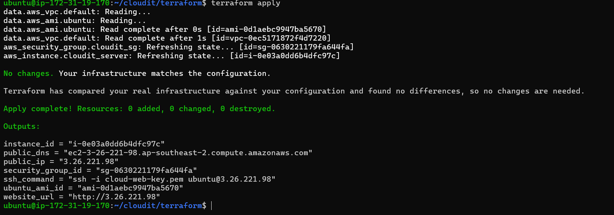

# CloudIt ☁️


CloudIt is an end-to-end Cloud & DevOps portfolio project built to demonstrate modern infrastructure automation and deployment practices using AWS and open-source DevOps tools.

The goal of this project is to simulate how cloud infrastructure is provisioned, deployed, monitored, and managed in a real production environment.

---

# Tech Stack

- AWS EC2
- Terraform
- Docker
- Linux (Ubuntu)
- Git
- GitHub

**Upcoming**

- Docker Compose
- GitHub Actions (CI/CD)
- Custom VPC
- Terraform Remote State (S3 + DynamoDB)
- Kubernetes
- Prometheus
- Grafana
- CloudWatch

---

# Current Project Status

| Phase | Status |
|--------|--------|
| Dockerized Website | ✅ Complete |
| Terraform Infrastructure | ✅ Complete |
| Documentation | ✅ Complete |
| Docker Compose | 🔜 Next |
| GitHub Actions CI/CD | ⏳ Planned |
| Custom VPC | ⏳ Planned |
| Remote State | ⏳ Planned |
| Kubernetes | ⏳ Planned |
| Monitoring | ⏳ Planned |
| Production Hardening | ⏳ Planned |

---

# Current Architecture

```text
                Developer
                    │
                    ▼
             GitHub Repository
                    │
                    ▼
              Terraform Code
                    │
        ┌───────────┴───────────┐
        │                       │
        ▼                       ▼
 Security Group           Ubuntu EC2
                                   │
                                   ▼
                              User Data
                                   │
                                   ▼
                               Docker
                                   │
                                   ▼
                         CloudIt Web Application
```

---

# Features Implemented

- Infrastructure as Code using Terraform
- Dynamic Ubuntu 22.04 AMI lookup
- AWS EC2 provisioning
- Security Group automation
- Encrypted gp3 root volume
- IMDSv2 enabled
- User Data automation
- Docker installation
- Automatic application deployment
- Infrastructure cleanup using Terraform Destroy

---
## Deployment Evidence

### Terraform Apply



### AWS EC2 Deployment


### Docker Verification


More deployment evidence is available in the [Terraform deployment guide](docs/terraform-deployment.md).

## Terraform Milestone

The first infrastructure milestone provisions and configures an AWS EC2 deployment using Terraform.

The workflow includes:

1. Selecting the latest Ubuntu 22.04 LTS AMI dynamically
2. Creating the Security Group
3. Provisioning the EC2 instance
4. Enforcing IMDSv2
5. Attaching an encrypted gp3 root volume
6. Running a User Data bootstrap script
7. Installing Docker
8. Building and launching the CloudIt web container
9. Verifying the deployment
10. Destroying temporary infrastructure to control cost

## Documentation

- [Terraform Deployment Guide](docs/terraform-deployment.md)
- [Terraform Configuration](terraform/README.md)
- [Deployment Evidence](docs/screenshots/)


---

# Repository Structure

```text
CloudIt/
│
├── docs/
│   ├── screenshots/
│   └── terraform-deployment.md
│
├── terraform/
│   ├── provider.tf
│   ├── variables.tf
│   ├── main.tf
│   ├── outputs.tf
│   ├── userdata.sh
│   └── README.md
│
└── README.md
```

---

# Roadmap

- ✅ Dockerized Website
- ✅ Terraform Infrastructure
- 🔜 Docker Compose
- GitHub Actions CI/CD
- Custom VPC
- Remote State
- Kubernetes
- Monitoring
- Production Hardening

---

## Author

**Krish Singh**

Aspiring Cloud and DevOps Engineer building hands-on projects with AWS, Terraform, Docker, Linux and CI/CD.

- GitHub: [krish307](https://github.com/krish307)
- LinkedIn: [Krish Singh](https://www.linkedin.com/in/krishsingh0001/)
