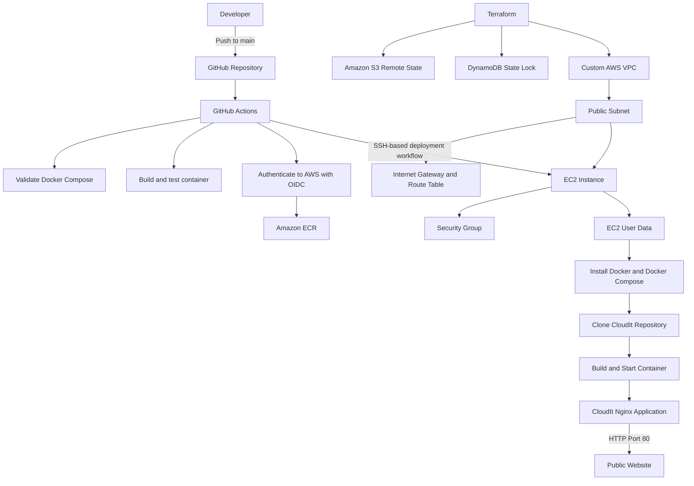
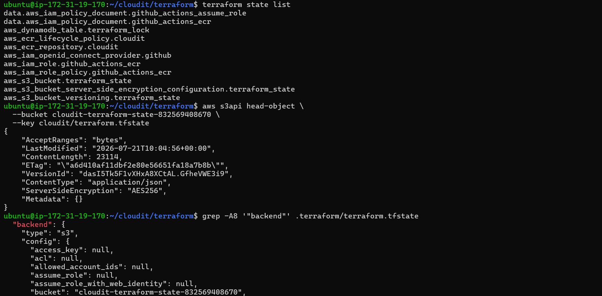
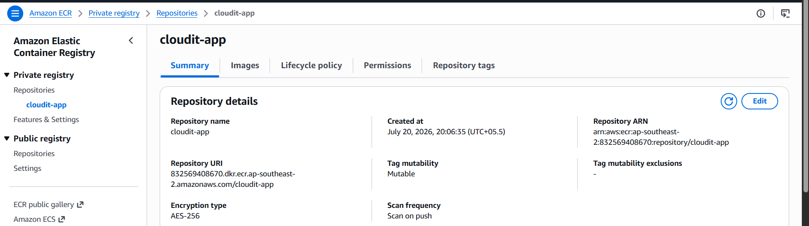
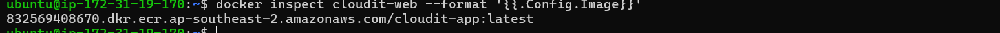
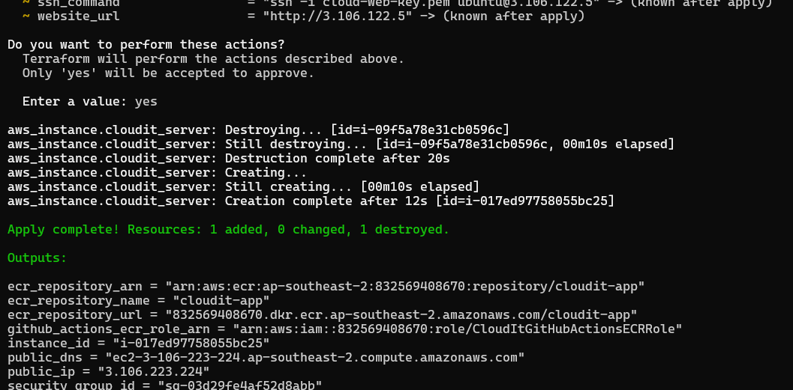
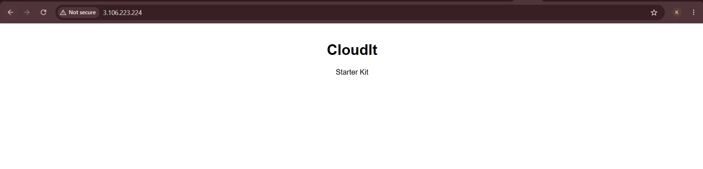

# ☁️ CloudIt

<p align="center">

### 🚀 End-to-End Cloud & DevOps Project

**Provision Infrastructure → Containerize → Automate → Deploy**

</p>

---

## 📖 Overview

CloudIt is an end-to-end Cloud and DevOps project built to demonstrate how an application can be provisioned, containerized, automated, and deployed on AWS using practical engineering workflows.

The project currently combines:

- Terraform-based AWS infrastructure provisioning
- A custom VPC and public networking
- Remote Terraform state using Amazon S3 and DynamoDB
- Automated EC2 bootstrapping through User Data
- Docker and Docker Compose
- Amazon Elastic Container Registry (ECR)
- GitHub Actions CI/CD
- Deployment validation and container health checks

CloudIt is being developed phase by phase, with each milestone extending the same project rather than creating isolated demonstrations.

---

## ✨ Current Capabilities

- ✅ Infrastructure as Code with Terraform
- ✅ Latest Ubuntu 22.04 LTS AMI lookup using a Terraform data source
- ✅ Custom AWS VPC
- ✅ Public subnet
- ✅ Internet Gateway and public route table
- ✅ Dedicated Security Group
- ✅ EC2 provisioning inside the custom network
- ✅ Automated server bootstrapping through EC2 User Data
- ✅ Automatic Docker Engine and Docker Compose installation
- ✅ Automatic repository cloning and application startup
- ✅ Dockerized Nginx web application
- ✅ Docker Compose deployment and health checks
- ✅ GitHub Actions validation and SSH-based deployment workflow
- ✅ Amazon ECR private image repository
- ✅ GitHub Actions authentication to AWS through IAM and OIDC
- ✅ Remote Terraform state in Amazon S3
- ✅ Terraform state locking with DynamoDB
- ✅ Public HTTP access to the deployed application

---

## 🛠️ Tech Stack

| Category | Technologies |
|---|---|
| Cloud | AWS EC2, VPC, S3, DynamoDB, ECR, IAM |
| Infrastructure as Code | Terraform, HCL |
| Networking | Public Subnet, Internet Gateway, Route Table, Security Groups |
| Containers | Docker, Docker Compose |
| CI/CD | GitHub Actions |
| Operating System | Ubuntu 22.04 LTS |
| Web Server | Nginx |
| Shell and Administration | Bash, SSH, Linux |
| Version Control | Git, GitHub |

---

## 🏗️ Architecture



> Amazon ECR is configured as the project's private container registry. The current EC2 bootstrap process builds the application from the repository during instance creation; using ECR as the runtime image source is a future deployment improvement.

---

## 🚀 Project Workflow

### Infrastructure provisioning

1. Terraform reads the AWS configuration and retrieves the latest supported Ubuntu AMI.
2. Terraform uses the remote S3 backend while DynamoDB coordinates state locking.
3. Terraform provisions the custom VPC, subnet, Internet Gateway, route table, Security Group, and EC2 instance.
4. EC2 User Data installs Docker Engine, Docker Compose, Git, and required packages.
5. User Data clones the CloudIt repository.
6. Docker Compose builds and starts the application.
7. The container health check confirms that the application is ready.
8. Terraform returns the instance ID, public IP, SSH command, and website URL.

### Application delivery

1. A change is pushed to the `main` branch.
2. GitHub Actions validates the Docker Compose configuration.
3. The workflow builds and tests the container.
4. The deployment job connects to EC2 over SSH.
5. The repository is synchronized and Docker Compose recreates the application.
6. HTTP verification checks the deployed service.

> Until CloudIt receives a stable endpoint such as an Elastic IP, load balancer, or DNS record, the EC2 host configured in GitHub Secrets must be updated after an instance replacement.

---

## 📂 Repository Structure

```text
CloudIt/
│
├── .github/
│   └── workflows/
│       └── docker-ci.yml
│
├── terraform/
│   ├── provider.tf
│   ├── variables.tf
│   ├── main.tf
│   ├── network.tf
│   ├── outputs.tf
│   ├── userdata.sh
│   └── terraform.tfvars
│
├── docs/
│   └── screenshots/
│
├── Website/
│
├── Dockerfile
├── compose.yaml
├── compose.ec2.yaml
└── README.md
```

> Local variable files, Terraform state files, private keys, and other sensitive files must not be committed to the repository.

---

## 📈 Project Progress

### ✅ Phase 1 — Terraform Infrastructure

- Configured the AWS provider
- Provisioned an EC2 instance
- Created a dedicated Security Group
- Added reusable variables and outputs
- Used a Terraform data source for the latest Ubuntu AMI

### ✅ Phase 2 — Docker

- Created the CloudIt Dockerfile
- Built the application on the official Nginx image
- Verified the container locally and on EC2

### ✅ Phase 3 — Docker Compose

- Added Docker Compose configuration
- Added container networking
- Added health checks
- Separated base and EC2 deployment configuration

### ✅ Phase 4 — GitHub Actions CI/CD

- Added automatic validation on pushes to `main`
- Built and tested the Docker image in GitHub Actions
- Added SSH-based deployment to EC2
- Added deployment verification

### ✅ Phase 5 — Documentation and Portfolio

- Documented the infrastructure and deployment workflow
- Added architecture diagrams
- Added milestone evidence and screenshots
- Organized the repository for portfolio use

### ✅ Phase 6 — Amazon ECR

- Created a private ECR repository
- Added an image lifecycle policy
- Configured a GitHub Actions IAM role
- Configured GitHub OIDC authentication
- Enabled secure image publishing without permanent AWS access keys

### ✅ Phase 7 — Remote Terraform State

- Created an S3 bucket for remote state
- Enabled bucket versioning
- Enabled server-side encryption
- Created a DynamoDB table for state locking
- Migrated local Terraform state to the remote backend
- Verified remote state operation

### ✅ Phase 8 — Custom VPC and Automated Provisioning

- Created a custom VPC
- Created a public subnet
- Attached an Internet Gateway
- Created a public route table and route
- Associated the subnet with the route table
- Attached the EC2 instance to the custom network
- Automated Docker and Docker Compose installation through User Data
- Automated repository cloning, container build, and application startup
- Replaced the EC2 instance from Terraform and verified clean provisioning
- Verified `cloud-init` completion
- Verified a healthy container on port 80
- Verified the application locally and through its public URL

---

## 🌍 Infrastructure as Code

Terraform manages the CloudIt infrastructure as code, making the environment reproducible and reviewable.

### Managed infrastructure

- Custom VPC
- Public subnet
- Internet Gateway
- Public route table
- Route table association
- Security Group
- Ubuntu EC2 instance
- Amazon ECR repository
- ECR lifecycle policy
- GitHub Actions OIDC provider
- IAM role and policy for ECR publishing
- S3 remote-state bucket
- S3 versioning and encryption
- DynamoDB state-lock table

### Terraform workflow

```bash
terraform init
terraform fmt
terraform validate
terraform plan
terraform apply
```

### Important outputs

- EC2 instance ID
- Public IP
- Public DNS
- Website URL
- SSH command
- Security Group ID
- Ubuntu AMI ID
- ECR repository URL
- Remote-state bucket
- State-lock table

---

## 🐳 Docker and Docker Compose

CloudIt is packaged as a Docker image based on Nginx.

Docker Compose manages:

- Image build
- Container creation
- Port publishing
- Container networking
- Health checks
- Container recreation during deployment

The current custom-VPC deployment publishes the application on:

```text
0.0.0.0:80 → container port 80
```

---

## ⚙️ Automated EC2 Bootstrapping

The Terraform-managed EC2 instance receives a User Data script during launch.

The script:

1. Updates Ubuntu packages.
2. Adds Docker's official Ubuntu repository.
3. Installs Docker Engine, Docker Buildx, and Docker Compose.
4. Enables and starts the Docker service.
5. Adds the Ubuntu user to the Docker group.
6. Clones the CloudIt repository into `/opt/cloudit`.
7. Builds and starts the application with Docker Compose.
8. Prints the final container status.

Provisioning logs are available at:

```bash
sudo cat /var/log/cloudit-userdata.log
```

Provisioning status can be checked with:

```bash
cloud-init status --wait
```

---

## 🚀 GitHub Actions CI/CD

CloudIt uses a two-stage GitHub Actions workflow.

### Docker validation

- Checks out the repository
- Validates Docker Compose
- Builds the application image
- Starts the application
- Performs HTTP verification
- Cleans up test resources

### Deployment

- Connects to EC2 using SSH and GitHub Secrets
- Synchronizes the server with the `main` branch
- Rebuilds and recreates the application
- Verifies that the deployment responds successfully

### ECR authentication

GitHub Actions uses OpenID Connect to assume a restricted AWS IAM role. This avoids storing permanent AWS access keys in GitHub.

---

## 🔒 Security Notes

CloudIt is currently a development and learning environment.

Implemented controls include:

- Dedicated Security Group
- Restricted IAM permissions for GitHub Actions
- OIDC authentication instead of permanent AWS credentials
- Encrypted and versioned Terraform state
- Terraform state locking
- Sensitive local files excluded from Git

Planned production hardening includes:

- Restricting SSH access to trusted sources
- Replacing direct public EC2 access with a load balancer
- HTTPS and managed certificates
- Stable DNS
- Least-privilege instance roles
- Private application subnets
- Improved secrets management

---

## 📸 Deployment Evidence

### Terraform infrastructure


### Docker Compose


### GitHub Actions


### Remote Terraform state




### Amazon ECR



---



### Phase 8 – Custom VPC & Automated Provisioning



Terraform successfully provisioned the custom VPC, public subnet, Internet Gateway, route table, Security Group, and EC2 instance. The instance was fully bootstrapped using EC2 User Data, installing Docker, Docker Compose, and automatically deploying the CloudIt application.

---



CloudIt is running successfully on the provisioned EC2 instance inside the custom VPC, demonstrating a fully automated Infrastructure as Code deployment with Terraform and Docker.


---

## 🎯 Challenges Solved

### Terraform template conflict

Terraform's `templatefile()` syntax initially conflicted with a Bash variable expression inside `userdata.sh`. The script was corrected so Terraform could render the User Data successfully.

### Docker Compose installation failure

Ubuntu's default package source did not provide the required `docker-compose-plugin`. The bootstrap process was updated to use Docker's official APT repository and install Docker Engine and Docker Compose together.

### Failed cloud-init deployment

The first custom-VPC instance completed infrastructure creation but stopped during User Data execution. Cloud-init logs were used to identify the exact failed package installation.

### Reproducible instance replacement

After fixing the bootstrap script, Terraform replaced the EC2 instance. The new instance completed cloud-init, started a healthy container, and served CloudIt on port 80 without manual configuration.

### Dynamic public IP

Replacing the EC2 instance changed its public IP. This demonstrated why production systems typically use an Elastic IP, load balancer, or DNS endpoint rather than depending directly on an ephemeral instance address.

---


### Cloud and AWS

- Amazon EC2
- Amazon VPC
- Amazon S3
- Amazon DynamoDB
- Amazon ECR
- AWS IAM
- Security Groups
- Public cloud networking

### Infrastructure as Code

- Terraform
- HCL
- Remote state
- State locking
- Data sources
- Variables and outputs
- Resource lifecycle and replacement
- Automated provisioning

### Containers

- Docker
- Docker Compose
- Nginx
- Image builds
- Container networking
- Health checks

### CI/CD and automation

- GitHub Actions
- Continuous Integration
- Continuous Deployment
- OIDC authentication
- SSH-based deployment
- Bash scripting
- EC2 User Data
- Cloud-init troubleshooting

### Linux and version control

- Ubuntu Server
- Linux administration
- Git
- GitHub
- SSH
- Package and service management

---

## 🔜 Roadmap

- Kubernetes deployment
- Amazon EKS
- Monitoring and observability
- Prometheus
- Grafana
- Amazon CloudWatch
- Production hardening
- Application Load Balancer
- HTTPS and DNS
- Nginx Ingress
- Horizontal scaling
- Database integration

---

## 🌐 Live Demo

The latest Terraform deployment exposed CloudIt over HTTP on port 80:

**http://3.106.223.224**

> The current endpoint uses the EC2 instance's public IP and may change when Terraform replaces the instance. The authoritative endpoint is available through the `website_url` Terraform output.

---

## 🤝 Contributing

CloudIt is part of my Cloud Engineering and DevOps learning journey.

Suggestions, improvements, and constructive feedback are welcome. Feel free to fork the repository and submit a pull request.

---

## 📄 License

This project is licensed under the MIT License.

---

## 👨‍💻 Author

### Krish Singh

**Aspiring Cloud and DevOps Engineer**

I build practical cloud infrastructure and DevOps projects using AWS, Terraform, Docker, Linux, and GitHub Actions.

- GitHub: https://github.com/krish307
- LinkedIn: https://www.linkedin.com/in/krishsingh0001/

---

## ⭐ Support

If you found this project useful, consider giving the repository a star.

<p align="center">

## ☁️ CloudIt

**Provision • Containerize • Automate • Deploy**

**Built with AWS, Terraform, Docker, Docker Compose, GitHub Actions, Ubuntu Linux, and Nginx.**

</p>