# ☁️ CloudIt

<p align="center">

### Production-Style Cloud & DevOps Platform

**Infrastructure as Code • Containerization • CI/CD • Kubernetes • Observability • Reliability • AWS**

</p>

---

## 🚀 Overview

CloudIt is an end-to-end Cloud and DevOps engineering project that demonstrates the design, automation, deployment, and operation of a containerized full-stack application across local Kubernetes and AWS environments.

The project evolved from a single containerized web application into a production-style platform combining infrastructure automation, application delivery, persistent data, orchestration, monitoring, reliability engineering, and automated AWS deployment.

CloudIt currently integrates:

- **AWS infrastructure provisioned with Terraform**
- **Custom VPC networking and EC2 compute**
- **Amazon ECR private container registry**
- **S3 remote Terraform state with DynamoDB state locking**
- **Docker and Docker Compose multi-container architecture**
- **Nginx frontend and reverse proxy**
- **FastAPI application backend**
- **PostgreSQL persistent database**
- **GitHub Actions CI/CD**
- **GitHub OIDC authentication to AWS**
- **Automated container build and image publishing to Amazon ECR**
- **Automated EC2 production deployment**
- **Kubernetes orchestration with Minikube**
- **PostgreSQL StatefulSet and persistent storage**
- **ConfigMaps and Kubernetes Secrets**
- **Startup, readiness, and liveness probes**
- **Horizontal Pod Autoscaling and Pod Disruption Budgets**
- **Rolling updates, rollback, scaling, and self-healing**
- **Prometheus metrics collection**
- **Blackbox Exporter endpoint monitoring**
- **Grafana observability dashboards**
- **Application and database health validation**
- **Persistent-data and infrastructure-recovery testing**

The project is designed around the complete engineering lifecycle:

**Provision → Build → Test → Publish → Deploy → Monitor → Recover**

---
## ⚡ Production Engineering Highlights

### ☁️ Infrastructure as Code

AWS infrastructure is managed through Terraform, including custom networking, EC2 compute, security controls, ECR, IAM integration, and remote Terraform state.

Infrastructure can be reproduced from code instead of relying on manually configured cloud resources.

### 🔄 Automated CI/CD

Pushes to the main branch trigger a GitHub Actions production pipeline that validates the application stack, builds container images, authenticates to AWS, publishes images to Amazon ECR, and deploys the latest release to EC2.

Deployment is followed by application and health-endpoint validation.

### 🐳 Multi-Container Application

The production application runs as three coordinated services:

- Nginx frontend and reverse proxy
- FastAPI backend API
- PostgreSQL database

Docker Compose manages service networking, health checks, startup dependencies, persistent storage, and production deployment.

### ☸️ Kubernetes Orchestration

CloudIt also runs as a Kubernetes workload with application replicas, an API deployment, PostgreSQL StatefulSet, persistent storage, Services, ConfigMaps, Secrets, resource controls, health probes, autoscaling, and disruption protection.

The environment has been tested for Pod recreation, self-healing, scaling, rolling updates, rollback, and persistent-data recovery.

### 📊 Observability

Prometheus, Blackbox Exporter, Grafana, and Kubernetes Metrics Server provide visibility into application availability, HTTP response behavior, resource utilization, and service health.

### 🗄️ Stateful Workload Engineering

PostgreSQL persistence is implemented across both deployment models:

- Kubernetes persistent storage for the PostgreSQL StatefulSet
- Docker volume persistence for the AWS production stack

Database data has been validated across workload recreation and EC2 host reboot scenarios.

### 🔐 Cloud Security

GitHub Actions authenticates to AWS using OpenID Connect rather than permanent AWS access keys.

The production EC2 instance uses an IAM instance profile to retrieve private application images from Amazon ECR, while Terraform state is remotely stored with encryption, versioning, and locking.

### ♻️ Recovery & Reliability

CloudIt has been deliberately tested beyond the initial deployment path.

Validation includes:

- Container health checks
- Kubernetes Pod self-healing
- PostgreSQL persistence
- Rolling deployment and rollback
- EC2 reboot recovery
- Automatic container restart
- Database reconnection
- Production health endpoint verification

---
## 🛠️ Tech Stack

| Domain | Technologies |
|---|---|
| **Cloud Platform** | AWS EC2, Amazon ECR, Amazon S3, DynamoDB, IAM |
| **Infrastructure as Code** | Terraform, HCL, Remote State |
| **Cloud Networking** | VPC, Public Subnet, Internet Gateway, Route Tables, Security Groups |
| **Containers** | Docker, Docker Compose, Docker Volumes |
| **Container Orchestration** | Kubernetes, Minikube, kubectl |
| **Kubernetes Workloads** | Deployments, ReplicaSets, StatefulSets, Services |
| **Kubernetes Configuration** | ConfigMaps, Secrets, Resource Requests & Limits |
| **Kubernetes Reliability** | Startup, Readiness & Liveness Probes, HPA, Pod Disruption Budget |
| **Backend** | Python, FastAPI, Uvicorn |
| **Database** | PostgreSQL |
| **Frontend / Reverse Proxy** | Nginx, HTML, CSS, JavaScript |
| **CI/CD** | GitHub Actions, AWS OIDC, Amazon ECR, SSH-based Deployment |
| **Observability** | Prometheus, Grafana, Blackbox Exporter, Kubernetes Metrics Server |
| **Operating System** | Ubuntu Linux |
| **Administration & Automation** | Bash, SSH, Linux Administration, EC2 User Data |
| **Version Control** | Git, GitHub |

## 🏗️ Architecture

CloudIt is implemented across two deployment environments:

1. **AWS Production** — Terraform-provisioned infrastructure running the full-stack application with Docker Compose and images delivered through Amazon ECR.
2. **Kubernetes Environment** — A local Minikube cluster used to engineer and validate orchestration, stateful workloads, scaling, self-healing, and observability.

### AWS Production Architecture

```mermaid
flowchart TD
DEV[Developer] -->|Push to main| GH[GitHub Repository]

GH --> GHA[GitHub Actions CI/CD]

GHA --> VAL[Validate & Test]
GHA -->|OIDC| AWS[AWS IAM]
GHA --> BUILD[Build Production Images]

BUILD --> ECR[Amazon ECR]

TF[Terraform] --> STATE[Amazon S3 Remote State]
TF --> LOCK[DynamoDB State Lock]
TF --> VPC[Custom AWS VPC]

VPC --> SUBNET[Public Subnet]
SUBNET --> IGW[Internet Gateway]
SUBNET --> EC2[Amazon EC2]

SG[Security Group] --> EC2

ECR -->|Pull Images| EC2
IAMROLE[EC2 IAM Instance Profile] --> EC2

GHA -->|Automated Deployment| EC2

EC2 --> COMPOSE[Docker Compose]

COMPOSE --> FRONTEND[Nginx Frontend]
COMPOSE --> API[FastAPI API]
COMPOSE --> DB[(PostgreSQL)]

FRONTEND -->|/api & /health| API
API --> DB

DB --> VOLUME[(Persistent Docker Volume)]

USER[Client] -->|HTTP :80| FRONTEND

## 🚀 Project Workflow

CloudIt separates infrastructure provisioning, continuous delivery, and application runtime into distinct engineering workflows.

### 1. Infrastructure Provisioning

1. Terraform initializes using the remote Amazon S3 backend with DynamoDB state locking.
2. Terraform retrieves the latest supported Ubuntu AMI dynamically.
3. A custom VPC, public subnet, Internet Gateway, route table, and Security Group are provisioned.
4. Terraform provisions the EC2 compute instance and supporting AWS resources.
5. EC2 User Data bootstraps the host with the required runtime tooling.
6. Amazon ECR provides the private registry for production application images.
7. Terraform exposes infrastructure outputs including the EC2 instance ID, public IP, SSH command, and application URL.

### 2. Continuous Integration

A push to the `main` branch triggers the GitHub Actions pipeline.

The pipeline:

1. Checks out the repository.
2. Creates the required CI environment configuration.
3. Validates the production Docker Compose configuration.
4. Builds the frontend and API container images.
5. Starts the stack in an isolated CI environment.
6. Verifies container health.
7. Tests the application and `/health` endpoint.
8. Authenticates to AWS using GitHub OIDC.

Only validated application changes proceed to image publishing and deployment.

### 3. Image Delivery

After validation:

1. GitHub Actions authenticates to Amazon ECR.
2. Production frontend and API images are built.
3. Images are tagged for the CloudIt ECR repository.
4. The images are pushed to Amazon ECR.
5. EC2 later retrieves these private images using its IAM instance profile.

This separates application image creation from the production host instead of relying on production-time image builds.

### 4. Production Deployment

The deployment job connects to the EC2 instance and:

1. Synchronizes the deployment configuration with the latest repository state.
2. Authenticates the EC2 host to Amazon ECR through its IAM role.
3. Pulls the latest production frontend and API images.
4. Recreates the application through the production Docker Compose configuration.
5. Starts the Nginx frontend, FastAPI backend, and PostgreSQL database.
6. Waits for application health checks.
7. Verifies the `/health` endpoint.
8. Validates the production operations interface.

The resulting runtime path is:

**Client → Nginx → FastAPI → PostgreSQL**

### 5. Runtime Recovery

The production containers use restart policies and health checks to recover after host or application interruptions.

CloudIt has been validated through an EC2 reboot while preserving PostgreSQL data in its persistent Docker volume. After the host returned, the frontend, API, and database containers restarted and returned to a healthy state without loss of the existing application record.

> The current deployment uses the EC2 public IP as its external endpoint. A custom domain, HTTPS termination, and a stable production entry point such as an Application Load Balancer are planned production enhancements.

---


## 📂 Repository Structure

```text
CloudIt/
│
├── .github/
│   └── workflows/
│       └── docker-ci.yml
│
├── backend/
│   ├── Dockerfile
│   ├── main.py
│   └── requirements.txt
│
├── Website/
│   ├── Dockerfile.fullstack
│   ├── nginx.fullstack.conf
│   ├── index.html
│   ├── operations.html
│   ├── operations.css
│   ├── operations.js
│   ├── script.js
│   └── style.css
│
├── terraform/
│   ├── backend.tf
│   ├── backend-config.tf
│   ├── provider.tf
│   ├── variables.tf
│   ├── network.tf
│   ├── main.tf
│   ├── ecr.tf
│   ├── github-oidc.tf
│   ├── outputs.tf
│   └── userdata.sh
│
├── kubernetes/
│   ├── namespace.yaml
│   ├── deployment.yaml
│   ├── service.yaml
│   ├── api-deployment.yaml
│   ├── api-service.yaml
│   ├── api-configmap.yaml
│   ├── postgres-statefulset.yaml
│   ├── postgres-service.yaml
│   ├── postgres-headless-service.yaml
│   ├── hpa.yaml
│   └── cloudit-pdb.yaml
│
├── monitoring/
│   ├── prometheus/
│   │   ├── prometheus-deployment.yaml
│   │   ├── prometheus-service.yaml
│   │   ├── prometheus-config.yaml
│   │   ├── blackbox-deployment.yaml
│   │   └── blackbox-config.yaml
│   │
│   ├── grafana/
│   │   ├── grafana-deployment.yaml
│   │   └── grafana-service.yaml
│   │
│   └── values-minikube.yaml
│
├── docs/
│   ├── screenshots/
│   ├── architecture.md
│   ├── terraform-deployment.md
│   ├── docker-compose.md
│   └── roadmap.md
│
├── compose.fullstack.yaml
├── compose.aws.fullstack.yaml
├── .dockerignore
├── .gitignore
├── LICENSE
└── README.md
---

## 🏗️ Engineering Capabilities

CloudIt combines infrastructure provisioning, containerized application delivery,
orchestration, persistence, observability, and automated production deployment
within a single end-to-end Cloud/DevOps environment.

### Infrastructure & AWS

- Infrastructure provisioned and managed with Terraform
- Custom VPC, public subnet, Internet Gateway, routing, and Security Groups
- EC2 compute provisioned from dynamically discovered Ubuntu AMIs
- Amazon ECR private registry for production container images
- Remote Terraform state stored in Amazon S3 with state locking
- IAM roles and GitHub OIDC for credential-minimized AWS access
- Automated EC2 bootstrap through User Data

### Containerized Application Platform

- Nginx frontend container
- FastAPI backend service
- PostgreSQL database
- Multi-container Docker Compose environments
- Dedicated local and AWS production Compose configurations
- Container health checks, dependency ordering, networking, and restart policies
- Persistent PostgreSQL storage using Docker volumes
- Nginx reverse proxy routing for `/api` and `/health`

### CI/CD & Production Delivery

- GitHub Actions pipeline triggered by changes to `main`
- Automated configuration validation and application testing
- Independent frontend and API image builds
- Production images published to Amazon ECR
- Deployment to EC2 over SSH
- EC2 authentication to ECR through an IAM instance role
- Automated image pull and container recreation
- Post-deployment health and endpoint verification
- Production deployment validated through complete CI/CD runs

### Kubernetes & Reliability Engineering

- Dedicated Kubernetes namespace and workload isolation
- Frontend and API Deployments and Services
- PostgreSQL deployed as a StatefulSet
- Persistent storage for stateful workloads
- Resource requests and limits
- Startup, readiness, and liveness probes
- Horizontal Pod Autoscaling
- Pod Disruption Budget
- Rolling updates and rollback validation
- Pod self-healing and controlled disruption testing
- ConfigMap and Secret-based configuration

### Observability

- Prometheus metrics collection
- Blackbox Exporter HTTP probing
- Grafana visualization
- Application availability monitoring
- HTTP status monitoring
- Response-time monitoring

### Persistence & Recovery

- PostgreSQL-backed operational data
- Persistent Docker volume for the AWS production database
- Kubernetes persistent storage for PostgreSQL
- Database persistence validated through workload recreation
- Production recovery validated through an EC2 reboot
- Frontend, API, and database containers automatically recovered after host restart
- Existing PostgreSQL records preserved through the recovery cycle
---

## 🌍 Infrastructure as Code

CloudIt's AWS infrastructure is provisioned and managed through Terraform, providing a reproducible and version-controlled infrastructure lifecycle.

### Managed infrastructure

- Custom VPC
- Public subnet
- Internet Gateway
- Public route table and route-table association
- Security Group
- Ubuntu EC2 compute instance
- Dynamically discovered Ubuntu AMI
- Amazon ECR private repository
- ECR lifecycle policy
- GitHub Actions OIDC provider
- IAM role and policies for CI/CD
- S3 remote-state backend
- S3 versioning and server-side encryption
- DynamoDB-based Terraform state locking

### Terraform workflow

```bash
terraform init
terraform fmt
terraform validate
terraform plan
terraform apply

### Important outputs

- EC2 instance ID
- Public IP
- Public DNS
- Website URL
- SSH command
- Security Group ID
- Ubuntu AMI ID
- ECR repository URL
- Remote-state bucket
- State-lock table

---

## 🐳 Containerization & Docker Compose

CloudIt uses a multi-container architecture that separates the web layer, application API, and persistent database.

### Application Containers

**Frontend**
- Nginx-based container
- Serves the CloudIt web interface and operations dashboard
- Reverse proxies `/api` and `/health` requests to the backend

**API**
- FastAPI application running through Uvicorn
- Handles application operations and database communication
- Exposes application health information

**Database**
- PostgreSQL 16
- Runs as an isolated database service
- Stores application operational data using persistent Docker storage

### Docker Compose Environments

CloudIt maintains separate Compose configurations for different runtime requirements:

- `compose.fullstack.yaml` — local full-stack development and validation
- `compose.aws.fullstack.yaml` — AWS production deployment

Docker Compose manages:

- Multi-container service orchestration
- Private container networking
- Environment-based configuration
- Health checks and dependency ordering
- Restart policies
- Persistent database volumes
- Production image selection

In the AWS production environment, only the Nginx frontend is exposed publicly:

```text
Internet
   │
   ▼
EC2 :80
   │
   ▼
Nginx Frontend
   │
   ├── /api/*  ──► FastAPI :8000
   └── /health ──► FastAPI :8000
                       │
                       ▼
                  PostgreSQL :5432
```

The API and PostgreSQL services remain inside the Docker network rather than exposing their application ports directly to the internet.

---

## ⚙️ Automated EC2 Bootstrapping

Terraform uses EC2 User Data to automatically prepare newly provisioned Ubuntu instances for containerized workloads.

During instance initialization, the bootstrap process:

1. Updates the Ubuntu package index.
2. Installs required system packages.
3. Configures Docker's official package repository.
4. Installs Docker Engine, Docker Buildx, and Docker Compose.
5. Enables and starts the Docker service.
6. Configures the Ubuntu user for Docker access.
7. Prepares the EC2 host for CloudIt deployment.

Infrastructure initialization and application delivery are intentionally separated:

```text
Terraform
    │
    ▼
Provision EC2
    │
    ▼
User Data Bootstrap
    │
    ▼
Docker-Ready Host
    │
    ▼
GitHub Actions CI/CD
    │
    ▼
Amazon ECR
    │
    ▼
Production Deployment
```

Provisioning status can be verified through cloud-init:

```bash
cloud-init status --wait
```

This allows replacement EC2 infrastructure to be prepared consistently without manually installing and configuring the container runtime.

---

## 🚀 GitHub Actions CI/CD

CloudIt uses a production CI/CD pipeline to validate application changes, publish container images, and deploy the full stack to AWS.

### Continuous Integration

Every push to `main` triggers automated validation:

- Checks out the repository
- Creates the required CI environment
- Validates the production Docker Compose configuration
- Builds the frontend and FastAPI container images
- Starts the full application stack
- Waits for container health checks
- Verifies the operations interface
- Tests the `/health` endpoint and database connectivity
- Cleans up CI resources after validation

### Container Image Delivery

After successful validation:

- GitHub Actions authenticates to AWS using OpenID Connect (OIDC)
- Frontend and API production images are built
- Images are tagged and pushed to Amazon ECR
- Permanent AWS access keys are not stored in the workflow

Production images:

```text
Amazon ECR
├── cloudit-app:frontend-latest
└── cloudit-app:api-latest
```

### Production Deployment

After the production images are published, the deployment job:

1. Connects securely to the EC2 host over SSH.
2. Synchronizes the deployment configuration with `main`.
3. Authenticates the EC2 host to Amazon ECR through its IAM instance role.
4. Pulls the latest frontend and API production images.
5. Recreates the application using `compose.aws.fullstack.yaml`.
6. Waits for the containers to become healthy.
7. Verifies `/operations.html` and `/health`.
8. Performs external HTTP validation against the deployed application.

The delivery flow is:

```text
Git Push
   │
   ▼
GitHub Actions
   │
   ├── Validate & Test
   │
   ▼
Build Production Images
   │
   ▼
Amazon ECR
   │
   ▼
EC2 Production Host
   │
   ▼
Docker Compose
   │
   ▼
Nginx + FastAPI + PostgreSQL
```

### AWS Authentication

GitHub Actions uses OIDC to assume a restricted IAM role for AWS operations, avoiding long-lived AWS credentials in GitHub.

The EC2 production host uses its own IAM instance profile to obtain temporary AWS credentials for pulling private images from Amazon ECR.

This separates CI/CD permissions from production runtime permissions.

### Production Pipeline Evidence

The production workflow successfully validates the full stack, publishes frontend and API images to Amazon ECR, and deploys the resulting release to AWS.

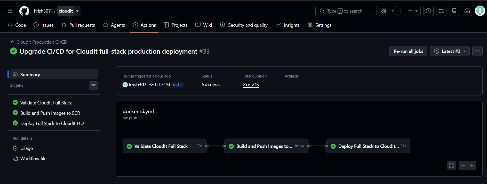


### Production Container Images

Frontend and API artifacts are maintained as independently deployable production images in Amazon ECR.

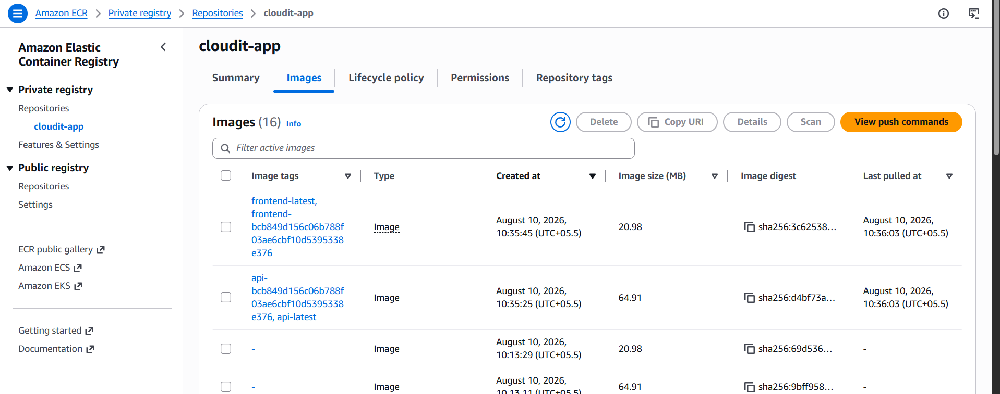

## 🔒 Security & Access Control

CloudIt applies separate security controls across infrastructure provisioning, CI/CD, container delivery, and application runtime.

### Implemented Controls

- GitHub Actions authenticates to AWS through OIDC instead of long-lived AWS access keys.
- CI/CD uses a dedicated IAM role with scoped AWS permissions.
- The EC2 production host uses an IAM instance profile to authenticate to Amazon ECR.
- Production ECR access does not require AWS credentials to be stored on the EC2 host.
- Terraform state is stored remotely in Amazon S3 with versioning and server-side encryption.
- Terraform state locking protects infrastructure operations from concurrent modification.
- Application secrets and environment-specific values are excluded from Git.
- Kubernetes secret manifests containing real credentials are excluded from version control while example manifests are maintained for reproducibility.
- PostgreSQL and the FastAPI service remain on the internal Docker network in the AWS production deployment.
- Only the Nginx frontend is directly exposed through the production host.
- Container health checks provide runtime health validation.

### Production Hardening Roadmap

Further hardening for an internet-facing production environment would include:

- HTTPS termination with a managed TLS certificate
- Stable DNS and domain configuration
- Application Load Balancer as the public entry point
- Private subnets for application and database workloads
- AWS Secrets Manager or Systems Manager Parameter Store for centralized secrets management
- Tighter administrative access controls
- Additional IAM least-privilege refinement
- Centralized application and infrastructure logging

---
## ☸️ Kubernetes Orchestration & Reliability

CloudIt includes a Kubernetes environment designed to validate container orchestration, stateful workloads, scaling, self-healing, and application reliability.

The Kubernetes environment is maintained separately from the current AWS production Docker Compose deployment.

### Application Workloads

CloudIt runs multiple application components inside the dedicated `cloudit` namespace:

- Nginx frontend Deployment
- FastAPI backend Deployment
- Kubernetes Services for internal service discovery
- PostgreSQL StatefulSet
- Headless Service for stable PostgreSQL network identity
- ConfigMaps for runtime configuration
- Kubernetes Secrets for sensitive configuration

### Health & Self-Healing

Application workloads use:

- Startup probes
- Readiness probes
- Liveness probes
- Resource requests and limits
- Automatic Pod recreation
- Rolling updates
- Rollback validation
- Graceful termination

These controls allow Kubernetes to detect unhealthy workloads, remove unready Pods from service, and automatically recover failed application instances.

### Stateful PostgreSQL

PostgreSQL runs as a StatefulSet rather than a stateless Deployment.

Persistent storage allows database data to survive Pod recreation:

```text
FastAPI
   │
   ▼
PostgreSQL Service
   │
   ▼
PostgreSQL StatefulSet
   │
   ▼
Persistent Volume
```

Persistence was validated by recreating the PostgreSQL Pod and confirming that the existing application data remained available after recovery.

### Scaling & Availability

CloudIt implements additional workload reliability controls:

- Multiple frontend replicas
- Horizontal Pod Autoscaler (HPA)
- CPU-based autoscaling
- Metrics Server integration
- Pod Disruption Budget (PDB)
- Controlled rolling updates
- Manual scaling validation
- Pod self-healing validation

The Pod Disruption Budget protects application availability during voluntary disruptions, while the HPA allows workload capacity to adjust based on resource utilization.

### Kubernetes Architecture

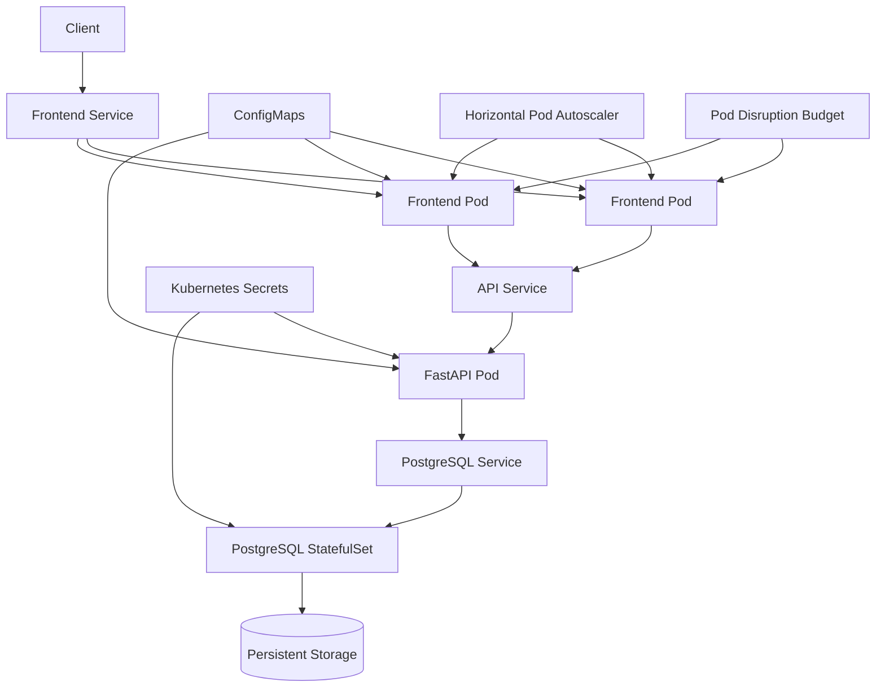
```mermaid
flowchart TD
    USER[Client] --> SERVICE[Frontend Service]

    SERVICE --> F1[Frontend Pod]
    SERVICE --> F2[Frontend Pod]

    F1 --> API_SERVICE[API Service]
    F2 --> API_SERVICE

    API_SERVICE --> API[FastAPI Pod]

    API --> PG_SERVICE[PostgreSQL Service]
    PG_SERVICE --> PG[PostgreSQL StatefulSet]

    PG --> STORAGE[(Persistent Storage)]

    CONFIG[ConfigMaps] --> F1
    CONFIG --> F2
    CONFIG --> API

    SECRET[Kubernetes Secrets] --> API
    SECRET --> PG

    HPA[Horizontal Pod Autoscaler] --> F1
    HPA --> F2

    PDB[Pod Disruption Budget] --> F1
    PDB --> F2
```

### Validation Evidence

Kubernetes deployment and reliability behavior were validated through workload recreation, controlled rolling updates, disruption testing, persistent-storage validation, and autoscaling tests.

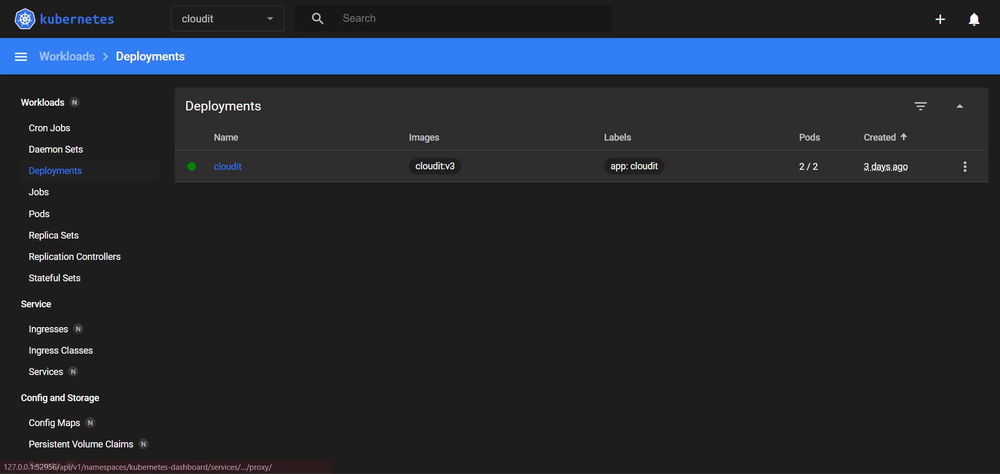

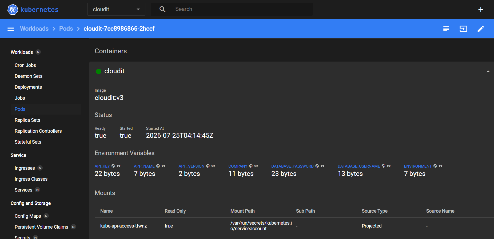

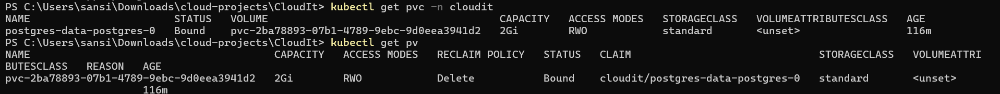

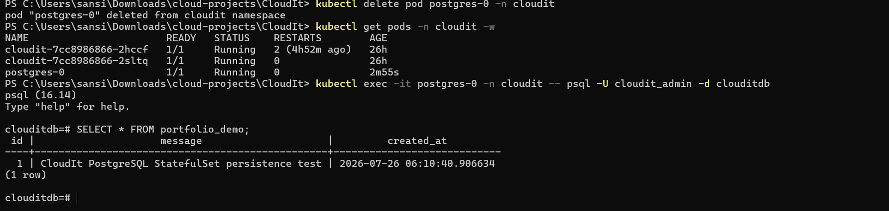

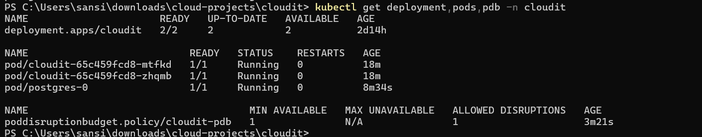

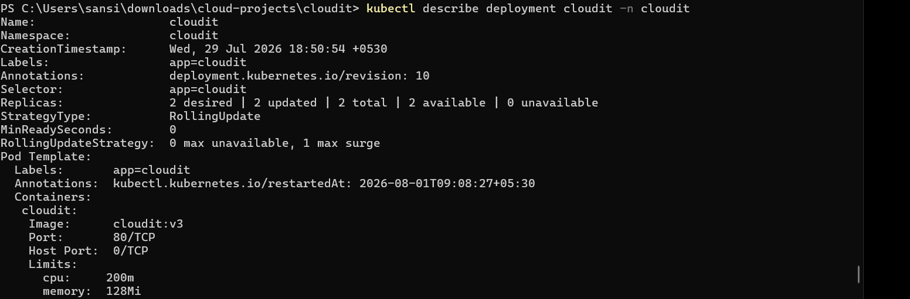

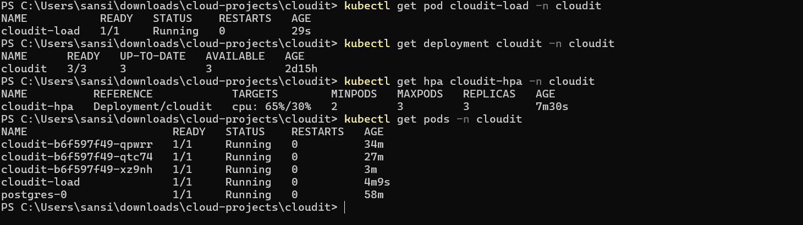

---
## 📊 Observability & Monitoring

CloudIt includes a Kubernetes-based observability stack for monitoring application availability and HTTP behavior.

### Monitoring Stack

- **Prometheus** — collects and stores monitoring metrics
- **Blackbox Exporter** — probes CloudIt HTTP endpoints
- **Grafana** — visualizes application health and performance
- **Kubernetes Metrics Server** — provides resource metrics used for workload monitoring and autoscaling

### HTTP Monitoring

Because the CloudIt frontend does not expose native Prometheus application metrics, Blackbox Exporter is used to actively probe the application.

The monitoring stack tracks:

- Application availability
- HTTP response status
- HTTP response time
- Endpoint reachability

The monitoring flow is:

```text
CloudIt Endpoint
       ▲
       │ HTTP Probe
       │
Blackbox Exporter
       ▲
       │
       │ Scrape
       │
   Prometheus
       │
       ▼
     Grafana
```

### Validation Evidence

Prometheus targets and Grafana dashboards were validated against the running CloudIt Kubernetes environment.

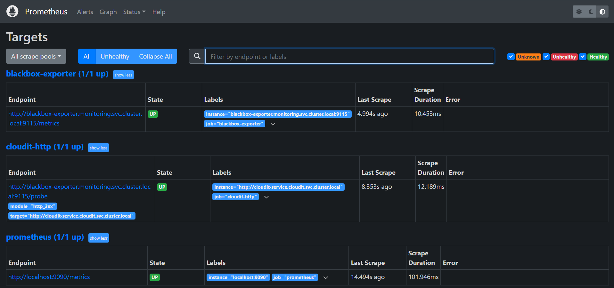

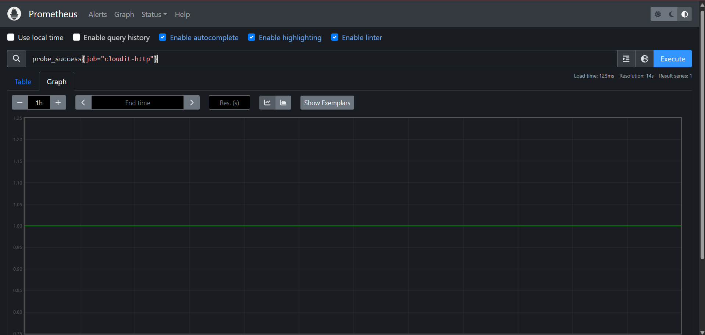

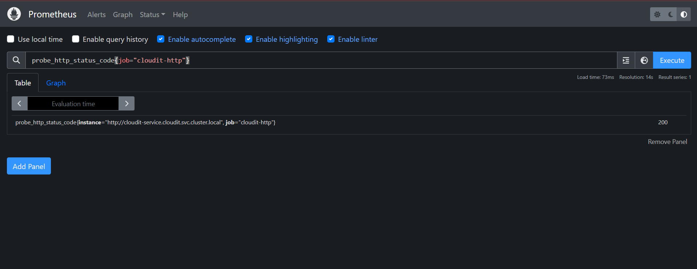

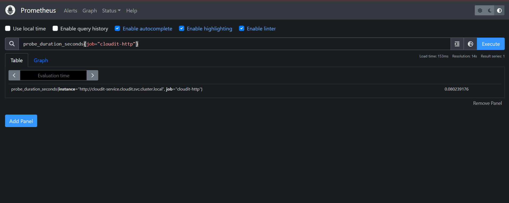

---

## 🎯 Engineering Challenges & Solutions

Building CloudIt required troubleshooting across infrastructure, containers, Kubernetes, CI/CD, IAM, persistence, and production deployment.

### Infrastructure Bootstrap Failures

Initial EC2 provisioning completed successfully at the Terraform layer while application bootstrap failed during cloud-init.

Cloud-init logs were used to isolate the package installation failure, after which the bootstrap process was moved to Docker's official Ubuntu repository and the infrastructure was recreated through Terraform.

### Terraform & User Data Integration

Terraform template rendering conflicted with shell variable expressions inside the EC2 bootstrap script.

The User Data implementation was corrected to separate Terraform interpolation from runtime shell expansion, allowing instances to be provisioned reproducibly.

### Stateful Workloads on Kubernetes

Introducing PostgreSQL required moving beyond stateless Deployments.

PostgreSQL was implemented using a StatefulSet and persistent storage, then validated by recreating the database Pod and confirming that application data survived the replacement.

### Kubernetes Availability & Scaling

Application reliability was improved using startup, readiness and liveness probes, resource requests and limits, multiple replicas, a Pod Disruption Budget, Metrics Server, and Horizontal Pod Autoscaling.

Controlled disruptions, rolling updates, Pod recreation, and autoscaling behavior were tested rather than relying only on configuration validation.

### Full-Stack Service Integration

CloudIt evolved from a static container into a multi-service application consisting of Nginx, FastAPI, and PostgreSQL.

Internal Docker networking and Nginx reverse-proxy routing were configured so the frontend could expose `/api` and `/health` while the API and database remained internal services.

### Production Image Delivery

The deployment model was migrated from rebuilding application containers directly on EC2 to publishing independently built frontend and API images to Amazon ECR.

GitHub Actions now validates the stack, builds production images, publishes them to ECR, and deploys those images to the production host.

### AWS Authentication on EC2

The production deployment initially failed because the EC2 host had the AWS CLI but no AWS credentials for authenticating to the private ECR registry.

A dedicated EC2 IAM role and instance profile were introduced with ECR pull permissions, allowing the host to obtain temporary credentials without storing permanent AWS access keys.

### Production Configuration & Health Validation

CI/CD deployment exposed environment-file and runtime configuration dependencies that differed between the CI runner and EC2 production host.

The deployment workflow was corrected to preserve production configuration while pulling and recreating services, followed by automated `/health` and operations-interface validation.

### Persistence & Host Recovery

Production reliability was validated beyond container health checks by rebooting the EC2 host.

Docker restart policies automatically recovered the Nginx, FastAPI, and PostgreSQL services, while the persistent PostgreSQL volume retained the existing application data.

### Dynamic Public Endpoint

EC2 replacement can change the instance's public IP, creating an operational dependency for SSH deployment and public access.

The current architecture documents this limitation explicitly; a stable DNS endpoint, HTTPS termination, and load-balanced entry point remain logical production hardening improvements.

---


## 🔜 Future Engineering Roadmap

CloudIt now implements the core infrastructure, application delivery, orchestration, persistence, observability, and CI/CD capabilities originally planned for the project.

Future development will focus on extending the current architecture toward a more scalable and hardened cloud platform.

- Migrate Kubernetes workloads from local Minikube to Amazon EKS
- Introduce an Application Load Balancer as the production entry point
- Configure a custom domain and managed HTTPS/TLS
- Move application and database workloads into private subnets
- Introduce AWS Secrets Manager or Systems Manager Parameter Store
- Add centralized logging and monitoring with Amazon CloudWatch
- Replace direct SSH-based deployment with a more isolated deployment mechanism
- Introduce managed database infrastructure such as Amazon RDS
- Extend automated integration and failure-recovery testing
- Evaluate multi-AZ architecture and higher-availability deployment patterns
- Add automated backup and database recovery procedures
- Continue tightening IAM permissions and production security controls

---

## 🌐 Live Deployment

CloudIt is deployed as a full-stack production environment on AWS EC2, with application delivery automated through GitHub Actions and production container images stored in Amazon ECR.

### Live Operations Dashboard

**http://16.176.219.226/operations.html**

The operations dashboard provides the primary interface for interacting with the deployed CloudIt application and its PostgreSQL-backed operational data.

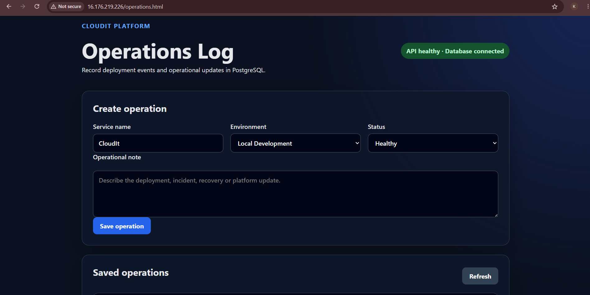


### Application Health

**http://16.176.219.226/health**

The health endpoint validates connectivity across the application and database layer:

```json
{
  "status": "healthy",
  "database": "connected"
}
```
The production health check confirms that the API is operational and successfully connected to PostgreSQL.

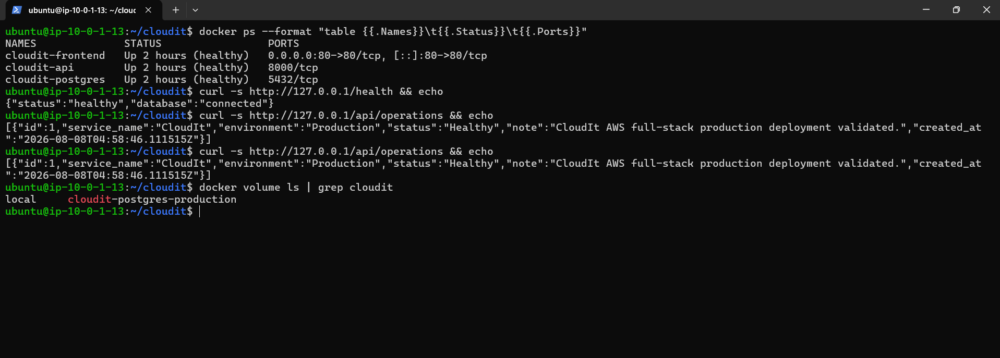


### Application Root

**http://16.176.219.226/**

The root endpoint serves the CloudIt frontend through the production Nginx container.

### Production Runtime

```text
Client
   │
   ▼
EC2 :80
   │
   ▼
Nginx
   │
   ├── /operations.html
   │
   ├── /api/* ──────► FastAPI
   │                     │
   └── /health ─────► FastAPI
                         │
                         ▼
                     PostgreSQL
```

> The current deployment uses the EC2 instance's public IP. The address may change if the instance is replaced; a stable DNS endpoint, load balancer, and HTTPS termination are planned production enhancements.

---

## 🤝 Contributing

CloudIt is an actively maintained Cloud/DevOps engineering project focused on infrastructure automation, container orchestration, CI/CD, reliability, and observability.

Contributions, architecture suggestions, issue reports, and engineering feedback are welcome.

To contribute:

1. Fork the repository.
2. Create a feature branch.
3. Implement and validate the change.
4. Commit with a clear message.
5. Open a pull request describing the change and its impact.

---

## 📄 License

This project is licensed under the MIT License.

See the `LICENSE` file for details.

---

## 👨‍💻 Author

**Krish Singh**

Cloud / DevOps Engineer focused on AWS infrastructure, Infrastructure as Code, containerization, Kubernetes, CI/CD automation, and production reliability.

**GitHub:** [github.com/krish307](https://github.com/krish307)

**LinkedIn:** [linkedin.com/in/krishsingh0001](https://www.linkedin.com/in/krishsingh0001)

---

## ⭐ Support

If you find CloudIt useful or interesting, consider starring the repository.

Feedback on the architecture, automation, reliability, and deployment approach is always welcome.
