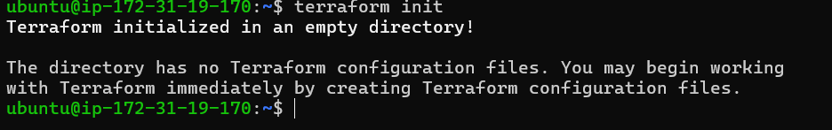
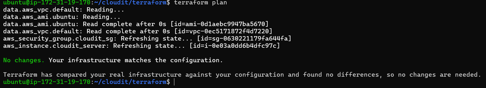
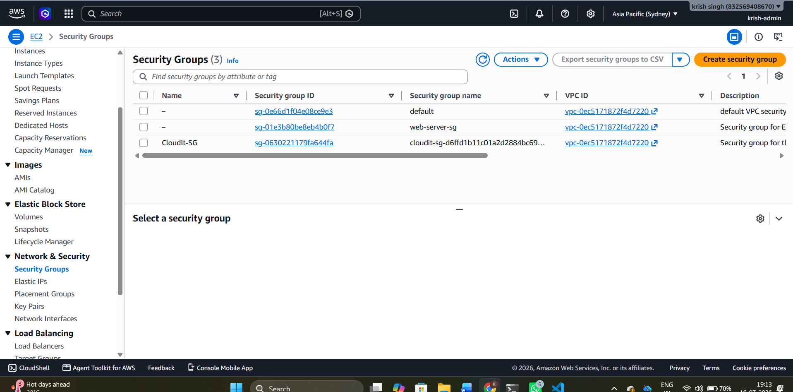
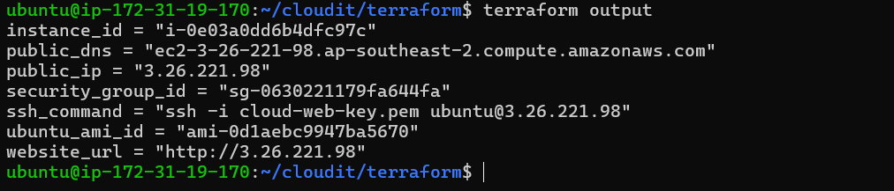

# CloudIt Terraform Deployment

## Overview

This phase of CloudIt provisions and configures an AWS EC2 application server using Terraform. The infrastructure is reproducible and includes dynamic Ubuntu AMI selection, network access controls, automated server bootstrapping, Docker installation, and application deployment.

## Architecture

```text
Developer
   |
   v
GitHub Repository
   |
   v
Terraform
   |
   +--> AWS Provider
   |
   +--> Dynamic Ubuntu AMI Lookup
   |
   +--> Security Group
   |
   +--> EC2 Instance
          |
          v
      User Data
          |
          +--> Install Docker and Git
          +--> Clone CloudIt
          +--> Build Docker image
          +--> Start Nginx container
          |
          v
      CloudIt Website
```

## AWS Resources Created

- Ubuntu 22.04 EC2 instance
- AWS Security Group
- Dynamically resolved Canonical Ubuntu AMI
- Encrypted gp3 root volume
- Public IPv4 address
- EC2 key-pair integration

## Terraform Features Used

- AWS provider configuration
- Input variables
- `terraform.tfvars`
- Data sources
- Resource dependencies
- Dynamic AMI resolution
- User Data templating
- Terraform outputs
- Terraform state
- Saved execution plans
- Infrastructure destruction

## Security Practices

- IMDSv2 required
- Encrypted EBS root volume
- HTTP and SSH controlled through Security Groups
- Terraform state excluded from Git
- `.pem` files excluded from Git
- Infrastructure destroyed after verification to control costs

## Deployment Commands

```bash
terraform init
terraform fmt
terraform validate
terraform plan -out=cloudit.tfplan
terraform apply cloudit.tfplan
terraform output
```

## Verification

The live application was verified using:

```bash
curl -I http://PUBLIC_IP
```

Expected response:

```text
HTTP/1.1 200 OK
Server: nginx
```

The Docker container was verified using:

```bash
docker ps
```

Expected container:

```text
IMAGE            PORTS                NAME
cloudit:latest   80:80                cloudit-web
```

## Automated Bootstrap Process

The EC2 User Data script:

1. Updates Ubuntu packages.
2. Installs Docker, Git, and curl.
3. Enables and starts Docker.
4. Clones the CloudIt GitHub repository.
5. Builds the CloudIt Docker image.
6. Starts the Nginx container.
7. Publishes the website on port 80.

## Problems Encountered

### Terraform executed from the wrong directory

Terraform returned `No configuration files` because commands were run from the repository root instead of the `terraform/` directory.

**Resolution:** Terraform commands were executed from `~/cloudit/terraform`.

### Git pull conflict

A locally modified `main.tf` prevented a fast-forward pull.

**Resolution:** The local file was backed up, restored, and synchronized with GitHub.

### SSH access failed after IP restriction

The internet provider assigned changing public IP addresses. A Security Group rule restricted to an older `/32` address blocked later SSH attempts.

**Temporary resolution:** SSH was opened briefly for verification.

**Permanent planned resolution:** AWS Systems Manager Session Manager will be added during production hardening.

### Docker permission denied

The `ubuntu` user initially required `sudo` to access Docker.

**Resolution:** The user was added to the Docker group and the session was refreshed.

## Lessons Learned

- Terraform must run from the folder containing `.tf` files.
- Dynamic AMI lookup avoids hardcoded region-specific IDs.
- User Data automates complete server configuration.
- Terraform makes infrastructure reproducible.
- Terraform state must not be committed publicly.
- A changing public IP is unreliable for permanent SSH allow-listing.
- Infrastructure does not need to remain running to prove it was built.

## Cost Management

After verification, the Terraform-created infrastructure was removed using:

```bash
terraform destroy
```

This proved that the environment could be recreated while avoiding unnecessary AWS charges.

## Deployment Evidence

### Terraform Initialization



### Terraform Plan



### Terraform Apply


### EC2 Instance


### Security Group



### Terraform Outputs



### Docker Container


## Next Phase

The next phase introduces Docker Compose, followed by GitHub Actions CI/CD.